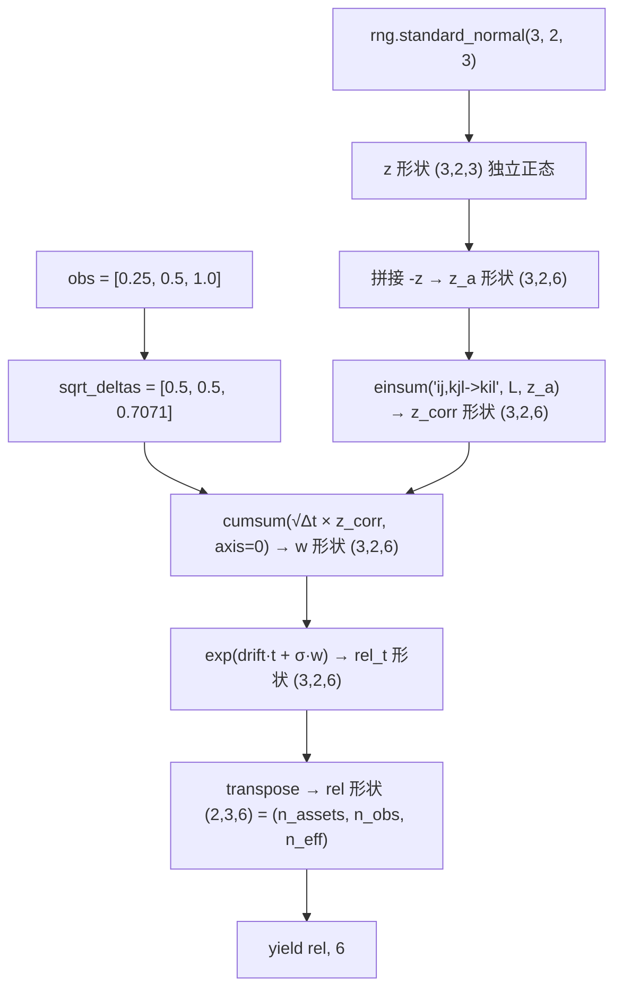

# `GBMModel.path_batches` 逐行详解（初学者版）

> 本文逐行解释 `src/fistqslab/models/gbm.py` 中的 `path_batches` 方法，
> 并配一套**完整可复现的数值例子**。建议边读边对照源码。
>
> 所有数值例子由 `np.random.default_rng(42)` 真实生成，可自行运行验证。

---

## 一、这段代码在干什么

一句话：**在指定的几个"观察日"上，模拟多标的几何布朗运动（GBM）的相对价格路径**。

它与 `terminal_batches`（只模拟到期日一个点）的区别是：

| | `terminal_batches` | `path_batches` |
|---|---|---|
| 时间点 | 只有终值 $S_T$ | 任意多个观察日 $t_1 < t_2 < \dots < t_m$ |
| 数组形状 | `(n_assets, n_paths)` | `(n_assets, n_obs, n_paths)` |
| 典型用途 | ELN / BEN / Rainbow 等只看终值的产品 | AutoCall（需要在观察日判断是否敲出） |

关键设计：**不模拟逐日节点**，只在产品真正需要的观察日布点，因此内存和时间都大幅节省。

### 输入 / 输出总览

```
输入：
  obs_year_fractions : 观察日的年数数组，升序，如 [0.25, 0.5, 1.0]
  n_paths            : 独立随机抽样数（antithetic 后路径翻倍）
  batch_size         : 每批抽样数（控制内存）
  antithetic         : 是否用对偶变量
  seed               : 随机种子（同 seed 结果逐位一致）

输出（yield）：
  rel : 形状 (n_assets, n_obs, n_eff)
        rel[i, k, j] = 第 i 个标的、第 k 个观察日、第 j 条路径的 S/S0
  n_eff : 本批有效路径数
```

---

## 二、数值例子总览

本教程全程使用以下迷你设置（2 个标的、3 个观察日、每批 3 条路径）：

```python
import numpy as np

obs     = np.array([0.25, 0.5, 1.0])   # 观察日：0.25 年、0.5 年、1 年
n_assets = 2                            # 2 个标的
n        = 3                            # 每批 3 条独立路径（antithetic 后 6 条）
rng      = np.random.default_rng(42)    # 固定种子，保证可复现

corr  = np.array([[1.0, 0.6], [0.6, 1.0]])   # 两个标的相关系数 0.6
sigma = np.array([0.25, 0.30])               # 两个标的的年化波动率
r     = 0.02                                 # 无风险利率
q     = np.array([0.0, 0.0])                 # 股息率
```

---

## 三、逐行解释

### 3.1 函数签名与文档

```python
def path_batches(
    self,
    obs_year_fractions: np.ndarray,   # 观察日年数
    n_paths: int,                     # 独立抽样数
    batch_size: int = 20_000,         # 每批抽样数（内存上界）
    antithetic: bool = True,          # 对偶变量
    seed: int | None = None,          # 随机种子
) -> Iterator[tuple[np.ndarray, int]]:
```

- 返回类型是**生成器**（`Iterator`），每次 `yield` 一批路径。调用方用
  `for rel, n_eff in model.path_batches(...)` 逐批消费，内存只装一批。
- `batch_size=20_000` 表示：即使要 100 万条路径，也是一批 2 万条地生成。

---

### 3.2 输入校验

```python
obs = np.asarray(obs_year_fractions, dtype=float)   # 转成 float64 数组
if obs.ndim != 1 or obs.size == 0:
    raise ValueError("obs_year_fractions 必须是一维非空数组")
if np.any(np.diff(obs) <= 0) or obs[0] <= 0:
    raise ValueError("obs_year_fractions 必须严格递增且全部为正")
```

- 第 1 行：`np.asarray(..., dtype=float)` 把 list / tuple 统一转成 `float64`
  ndarray，避免后面整数数组参与运算出问题。
- 第 2~3 行：必须是**一维且非空**。
- 第 4~5 行：观察日必须**严格递增**（`np.diff(obs) <= 0` 表示有相等或倒退），
  且第一个观察日必须为正。时间倒流或停在 0 点没有金融意义。

> 本例：`obs = [0.25, 0.5, 1.0]`，`np.diff` = `[0.25, 0.5]` 全为正 ✓

---

### 3.3 准备随机数生成器

```python
rng = self._make_rng(seed)
```

等价于 `rng = np.random.default_rng(seed)`——**局部生成器**，不污染全局
`np.random`。同 `seed` 得到逐位一致的结果，这是可复现性与 CRN Greeks 的基础。

---

### 3.4 计算每时段的标准差

```python
n_obs = obs.size
sqrt_deltas = np.sqrt(np.diff(np.concatenate(([0.0], obs))))
```

**数值过程**（本例）：

```text
obs                  = [0.25, 0.5, 1.0]
np.concatenate(([0.0], obs))  = [0, 0.25, 0.5, 1.0]    形状 (4,)
np.diff(...)         = [0.25, 0.25, 0.5]               形状 (3,)  ← 每段时长 Δt
np.sqrt(...)         = [0.5, 0.5, 0.7071]              形状 (3,)  ← √Δt
```

**数学含义**：标准布朗运动在第 $k$ 个时段的增量服从

$$\Delta W_k \sim \mathcal{N}(0, \Delta t_k), \qquad \Delta t_k = t_k - t_{k-1}$$

其标准差就是 $\sqrt{\Delta t_k}$。把 `[0.0]` 接在最前面，是为了把
"从 0 到第一个观察日"也算作一个时段。

---

### 3.5 分批循环

```python
remaining = n_paths
while remaining > 0:
    n = min(batch_size, remaining)
```

- 每次取 `min(batch_size, remaining)` 个样本，保证最后一批不超量。
- 比如 `n_paths=7, batch_size=3`：批大小依次是 3、3、1。

> 本例为演示，直接把 `n=3`。

---

### 3.6 生成独立标准正态随机数

```python
z = rng.standard_normal((n_obs, self.n_assets, n))
```

生成形状 `(n_obs, n_assets, n)` 的数组。**轴的约定（重要）**：

| 轴 | 含义 | 本例长度 |
|---|---|---|
| 轴 0（`k`） | 观察日 | 3 |
| 轴 1（`j`） | 标的（资产） | 2 |
| 轴 2（`l`） | 路径 | 3 |

**数值**（`z`，保留 4 位小数）：

```text
z[k, j, l]
k=0 (t=0.25):  j=0: [ 0.3047, -1.0400,  0.7505]
               j=1: [ 0.9406, -1.9510, -1.3022]
k=1 (t=0.5):   j=0: [ 0.1278, -0.3162, -0.0168]
               j=1: [-0.8530,  0.8794,  0.7778]
k=2 (t=1.0):   j=0: [ 0.0660,  1.1272,  0.4675]
               j=1: [-0.8593,  0.3688, -0.9589]
```

每个数字都是独立的标准正态样本。此时各标的之间**互不相关**。

---

### 3.7 对偶变量（antithetic）

```python
if antithetic:
    z = np.concatenate((z, -z), axis=-1)
```

沿**最后一维（路径维）**拼接相反数，路径数翻倍（3 → 6）：

- 路径 0~2：$z$ 原始样本
- 路径 3~5：恰好是路径 0~2 的相反数 $-z$

```text
z_a 形状 (3, 2, 6)
z_a[k, j, 0] = -z_a[k, j, 3]   （逐元素验证：True）
```

**为什么有用**：方差缩减。若 payoff 关于随机数近似对称（比如看涨期权），
成对的正负样本能让均值估计的方差大幅下降。本例路径 0 与路径 3 在后续所有
变换后仍互为"镜像"，因为相关性变换是线性的（见 3.8）。

---

### 3.8 Cholesky 相关变换

```python
z_corr = np.einsum("ij,kjl->kil", self._chol, z)
```

这是全文最"难"的一行，拆开看：

- `self._chol` = $L$，是资产相关矩阵 $\Sigma$ 的 Cholesky 分解，
  满足 $L L^\top = \Sigma$。本例：

  $$\Sigma = \begin{bmatrix} 1.0 & 0.6 \\ 0.6 & 1.0 \end{bmatrix}
  \;\Rightarrow\; L = \begin{bmatrix} 1.0 & 0 \\ 0.6 & 0.8 \end{bmatrix}$$

- `einsum` 下标 `"ij,kjl->kil"` 的含义：

  | | 下标 | 含义 |
  |---|---|---|
  | `self._chol` | `i, j` | 输出资产 `i`、被求和资产 `j` |
  | `z` | `k, j, l` | 观察日 `k`、资产 `j`、路径 `l` |
  | 输出 | `k, i, l` | 观察日 `k`、**相关后**资产 `i`、路径 `l` |

  `j` 在两个输入中都出现、但不在输出中 → 对 `j` 求和：

  $$z\_corr[k, i, l] = \sum_{j} L[i, j] \cdot z[k, j, l]$$

  等价于对每个 `(k, l)` 切片做 `L @ z[k, :, l]`。

- **为什么要这么做**：独立样本经过线性变换后协方差为
  $\mathrm{Cov}(Lz) = L I L^\top = \Sigma$，于是 `z_corr` 的各标的之间就
  有了指定的相关系数 0.6。

**数值验证**（取第 0 条路径，观察日 0.25，即 `z_corr[0, :, 0]`）：

```text
资产0：z_corr[0,0,0] = 1.0·0.3047 + 0·0.9406       = 0.3047
资产1：z_corr[0,1,0] = 0.6·0.3047 + 0.8·0.9406
                     = 0.18282   + 0.75248         = 0.9353
```

完整三条路径在 `t=0.25` 的 `z_corr[0, :, :]`：

```text
资产0: [0.3047, -1.0400,  0.7505]
资产1: [0.9353, -1.1833,  0.1206]   ← 与资产0 同涨同跌倾向（相关系数 0.6）
```

> 注：`z_corr` 每个元素仍是标准正态（均值为 0、方差为 1），但**同一观察日
> 内不同资产之间**现在相关了。

---

### 3.9 累加成布朗运动

```python
w = np.cumsum(sqrt_deltas[:, None, None] * z_corr, axis=0)
```

分两步看：

**（a）`sqrt_deltas[:, None, None]` 是广播加轴**：

| 表达式 | 形状 |
|---|---|
| `sqrt_deltas` | `(3,)` |
| `sqrt_deltas[:, None, None]` | `(3, 1, 1)` |

与形状 `(3, 2, 6)` 的 `z_corr` 相乘时，`(3, 1, 1)` 自动广播为
"每个观察日 `k` 用自己的 √Δt_k，作用于该观察日的所有资产、所有路径"。

**（b）`np.cumsum(..., axis=0)` 沿观察日轴累加**：

$$W(t_k) = \sum_{i=1}^{k} \sqrt{\Delta t_i} \cdot z\_corr[i]$$

**数值验证**（第 0 条路径，资产 0）：

```text
z_corr[0,0,0] = 0.3047,  √Δt₀ = 0.5        → 增量0 = 0.1524
z_corr[1,0,0] = 0.1278,  √Δt₁ = 0.5        → 增量1 = 0.0639
z_corr[2,0,0] = 0.0660,  √Δt₂ = 0.7071     → 增量2 = 0.0467

w[0,0,0] = 0.1524
w[1,0,0] = 0.1524 + 0.0639 = 0.2163
w[2,0,0] = 0.2163 + 0.0467 = 0.2630
```

`w[k, i, l]` 就是标的 `i` 在观察日 `t_k`、路径 `l` 的**累计相关布朗运动值**
$W_{t_k}$（对应风险中性测度下带漂移的 GBM 所需的扩散项）。

---

### 3.10 指数化：几何布朗运动

```python
rel = np.exp(
    self._drift[None, :, None] * obs[:, None, None]
    + self._sigma[None, :, None] * w
)
```

这就是 GBM 的离散解：

$$\frac{S_{t_k}}{S_0} = \exp\Big(\big(r - q - \tfrac{1}{2}\sigma^2\big) t_k + \sigma W_{t_k}\Big)$$

**（a）`self._drift`** 在 `__init__` 里定义为

```python
self._drift = market.risk_free_rate - market.dividend_vector - 0.5 * market.volatility_vector**2
```

即 $r - q - \tfrac12\sigma^2$。本例：`drift = [0.02 - 0 - 0.03125, 0.02 - 0 - 0.045] = [-0.0112, -0.025]`。

**（b）广播对齐**：

```text
self._drift[None, :, None]  形状 (1, 2, 1)   ← 按资产
obs[:, None, None]          形状 (3, 1, 1)   ← 按观察日
self._sigma[None, :, None]  形状 (1, 2, 1)   ← 按资产
w                           形状 (3, 2, 6)   ← 观察日×资产×路径
```

乘积自动广播到 `(3, 2, 6)`：每个标的用各自的漂移与波动率，每个观察日用各自
的时间 $t_k$。

**数值验证**（第 0 条路径，路径 0）：

```text
资产0, t=0.25:
  drift·t  = -0.0112 × 0.25 = -0.0028
  σ·w      = 0.25 × 0.1524   =  0.0381
  rel      = exp(-0.0028 + 0.0381) = exp(0.0353) = 1.0359   ✓

资产1, t=1.0:
  drift·t  = -0.025 × 1.0   = -0.0250
  σ·w      = 0.30 × (-0.2933) = -0.0880
  rel      = exp(-0.0250 - 0.0880) = exp(-0.1130) = 0.8932   ✓
```

得到 `rel_t`（形状 `(3, 2, 6)`，观察日×资产×路径）的第 0 条路径：

```text
rel_t[:, :, 0] =
t=0.25: [1.0359, 1.1434]     ← 资产0 小涨 3.6%，资产1 大涨 14.3%
t=0.5 : [1.0496, 1.0376]
t=1.0 : [1.0560, 0.8932]     ← 资产1 一路涨后大跌
```

---

### 3.11 转置为约定布局

```python
rel = np.transpose(rel, (1, 0, 2))
```

把 `(n_obs, n_assets, n_eff)` 变成 `(n_assets, n_obs, n_eff)`，与
`terminal_batches` 的"资产在最前"风格统一，也方便产品层写
`np.min(rel, axis=0)` 求 worst-of。

```text
转置后 rel 形状 (2, 3, 6)
rel[0] = 标的0 的全部数据（3 个观察日 × 6 条路径）
rel[1] = 标的1 的全部数据
```

**核对**：`rel[0, 0, :]`（标的 0、第一个观察日、6 条路径）应等于
`rel_t[0, 0, :]`，验证结果为 `True`：

```text
rel[0,0,:] = [1.0359, 0.8756, 1.0953, 0.9599, 1.1356, 0.9079]
```

> 注意第 4 个数字 0.9599 = 1 / 1.0359 —— antithetic 镜像路径的体现
> （指数函数把 $z \mapsto -z$ 映射为 $rel \mapsto 1/rel$，几何上成立）。

---

### 3.12 产出本批

```python
yield rel, rel.shape[-1]
remaining -= n
```

- `yield` 把本批数据交给调用方（如 `MonteCarloEngine` 累加 payoff），
  生成器暂停，下次循环再取下一批。
- `rel.shape[-1]` 是本批有效路径数（antithetic 后是 `2 × n`）。
- `remaining -= n` 推进剩余量，循环直至全部生成。

---

## 四、全流程数据流图



---

## 五、数学公式汇总

$$S_{t_k} = S_0 \exp\!\Big(\big(r - q - \tfrac{1}{2}\sigma^2\big) t_k + \sigma W_{t_k}\Big)$$

$$W_{t_k} = \sum_{i=1}^{k} \sqrt{\Delta t_i}\; \big(L z\big)_i, \qquad
L L^\top = \Sigma, \qquad z_i \overset{\text{i.i.d.}}{\sim} \mathcal{N}(0, 1)$$

- $\Delta t_i = t_i - t_{i-1}$（`t_0 = 0`）
- $\Sigma$ = 资产相关矩阵（`market.correlation_matrix`）
- $q$ = 连续股息率，$\sigma$ = 年化波动率，$r$ = 连续复利无风险利率

---

## 六、常见疑问

**Q1：为什么 `z` 是三维，`einsum` 里 `k`、`l` 是什么？**

`k` = 观察日（轴 0），`l` = 路径（轴 2），`j` = 被收缩的资产维（轴 1）。
einsum 在保留 `k`、`l` 的前提下，对 `j` 求和施加相关性。

**Q2：为什么不用 `self._chol @ z`？**

因为 `z` 的资产维在**中间**（`k, j, l`），`@` 的矩阵广播规则只对齐
"末尾两维"，对不上这个布局。`einsum` 用显式下标把"收缩哪个轴"写清楚，
不易出错。若把 `z` 重排成 `(l, j, k)` 布局，`@` 也可行，但要多一次
`transpose`。

**Q3：antithetic 在相关性变换后还成立吗？**

成立。`z → -z` 是线性变换，`L·(-z) = -L·z`，所以相关化后配对路径仍互为
相反数，方差缩减效果不被破坏（见 3.11 的 `1/rel` 验证）。

**Q4：为什么 `sqrt_deltas` 要加两个 `None` 轴？**

`[:, None, None]` 把 `(3,)` 变成 `(3, 1, 1)`，让广播规则沿"观察日"轴对齐：
每个观察日用各自的 √Δt_k，乘到该观察日所有资产、所有路径上。不加轴会因
维度不匹配报错（`(3,)` 与 `(3, 2, 6)` 无法广播）。

**Q5：返回的是相对价格还是绝对价格？**

相对价格 $S/S_0$。产品层（ELN/BEN/Rainbow/AutoCall）的 payoff 全部基于
相对收益（worst-of 等），不需要再除以期初价。

---

## 七、完整可运行的最小示例

```python
import numpy as np
from fistqslab import GBMModel, MarketState

market = MarketState(
    spots=[100.0, 90.0],
    risk_free_rate=0.02,
    volatilities=[0.25, 0.30],
    correlation=[[1.0, 0.6], [0.6, 1.0]],
)
model = GBMModel(market)

obs = np.array([0.25, 0.5, 1.0])
for rel, n_eff in model.path_batches(obs, n_paths=6, batch_size=4, seed=42):
    print("批次:", rel.shape, "有效路径数:", n_eff)
    print("  标的0:", rel[0, :, 0])   # 第 0 条路径，标的 0 在 3 个观察日的相对价
    print("  标的1:", rel[1, :, 0])
```

输出示例（第 0 条路径 ≈ 本文数值）：

```text
批次: (2, 3, 8) 有效路径数: 8
  标的0: [1.0359 1.0496 1.056 ]
  标的1: [1.1434 1.0376 0.8932]
```

---

## 附录：Cholesky 分解详解

> 本文 3.8 节用到了 `np.linalg.cholesky`，这一节把它的来龙去脉讲透，
> 读完你就能明白"为什么一个下三角矩阵 $L$ 能让模拟出的资产带相关性"。

### A.1 什么是 Cholesky 分解

**定义**：对一个对称正定矩阵 $A$，可以把它唯一分解为一个**下三角矩阵**
$L$ 与其转置的乘积：

$$A = L L^{\top}, \qquad
L = \begin{bmatrix}
l_{11} & 0 & \cdots & 0 \\
l_{21} & l_{22} & \cdots & 0 \\
\vdots & \vdots & \ddots & \vdots \\
l_{n1} & l_{n2} & \cdots & l_{nn}
\end{bmatrix}$$

**类比**：就像"正数的平方根"（$\sqrt{a} \cdot \sqrt{a} = a$），
Cholesky 是**矩阵版本的"平方根"**——只不过矩阵不唯一一个因子，而是
"一个矩阵乘它的转置"。

| 标量世界 | 矩阵世界 |
|---|---|
| 正数 $a > 0$ | 对称正定矩阵 $A$ |
| 平方根 $\sqrt{a}$（$\sqrt{a}\cdot\sqrt{a} = a$） | Cholesky 因子 $L$（$L L^\top = A$） |
| 用 $\sqrt{a}$ 可以恢复 $a$ | 用 $L$ 可以恢复 $A$ |

### A.2 为什么必须是"对称正定"

- **对称**：协方差/相关矩阵天然对称（$\mathrm{Cov}(X_i, X_j) = \mathrm{Cov}(X_j, X_i)$），
  相关矩阵的对角线还都是 1。
- **正定**：任何非零随机向量 $w$ 的方差都满足
  $w^\top \Sigma w = \mathrm{Var}(w^\top X) \ge 0$。若某组资产完全共线
  （比如标的 2 恒等于 2×标的 1），矩阵只是**半正定**，此时 Cholesky 会因
  对角线出现非正值而报 `LinAlgError`——这其实是**帮你提前发现数据问题**。

> 校验小技巧：相关性矩阵对角线必须全为 1、对称、且特征值全 ≥ 0。
> `np.linalg.eigvalsh(corr).min() < 0` 说明输入的相关系数在数学上不成立。

### A.3 手工计算 Cholesky（2×2 例子）

对 $A = \begin{bmatrix} a & b \\ b & c \end{bmatrix}$，令
$L = \begin{bmatrix} x & 0 \\ y & z \end{bmatrix}$，展开 $LL^\top$：

$$LL^\top = \begin{bmatrix} x^2 & xy \\ xy & y^2 + z^2 \end{bmatrix}
= \begin{bmatrix} a & b \\ b & c \end{bmatrix}$$

逐元素对比得递推式：

$$x = \sqrt{a}, \qquad y = \frac{b}{x}, \qquad z = \sqrt{c - y^2}$$

**代入本文例子** $\Sigma = \begin{bmatrix} 1.0 & 0.6 \\ 0.6 & 1.0 \end{bmatrix}$：

$$x = \sqrt{1.0} = 1.0, \qquad
y = \frac{0.6}{1.0} = 0.6, \qquad
z = \sqrt{1.0 - 0.6^2} = \sqrt{0.64} = 0.8$$

$$L = \begin{bmatrix} 1.0 & 0 \\ 0.6 & 0.8 \end{bmatrix}$$

**验证**：

$$LL^\top = \begin{bmatrix} 1.0 & 0 \\ 0.6 & 0.8 \end{bmatrix}
\begin{bmatrix} 1.0 & 0.6 \\ 0 & 0.8 \end{bmatrix}
= \begin{bmatrix} 1.0 & 0.6 \\ 0.6 & 0.36+0.64 \end{bmatrix}
= \begin{bmatrix} 1.0 & 0.6 \\ 0.6 & 1.0 \end{bmatrix} \;\checkmark$$

一般 $n \times n$ 情形有类似的**逐列递推**公式（这就是 `np.linalg.cholesky`
内部做的事）：

$$l_{jj} = \sqrt{A_{jj} - \sum_{k<j} l_{jk}^2}, \qquad
l_{ij} = \frac{1}{l_{jj}}\Big(A_{ij} - \sum_{k<j} l_{ik} l_{jk}\Big) \;\; (i > j)$$

### A.4 如何用 Cholesky 生成相关正态变量（核心思想）

**目标**：想生成随机向量 $X \sim \mathcal{N}(\mu, \Sigma)$（带协方差 $\Sigma$），
但随机数生成器只能给**独立的**标准正态 $Z \sim \mathcal{N}(0, I)$。

**做法**：令 $X = \mu + L Z$，其中 $LL^\top = \Sigma$。验证：

$$\mathrm{Cov}(X) = \mathrm{Cov}(LZ) = L \cdot \underbrace{\mathrm{Cov}(Z)}_{I} \cdot L^\top = L L^\top = \Sigma$$

**数值验证**（本文例，$Z = \begin{bmatrix} z_1 \\ z_2 \end{bmatrix}$ 独立标准正态）：

$$X = \begin{bmatrix} 1.0 & 0 \\ 0.6 & 0.8 \end{bmatrix}
\begin{bmatrix} z_1 \\ z_2 \end{bmatrix}
= \begin{bmatrix} z_1 \\ 0.6 z_1 + 0.8 z_2 \end{bmatrix}$$

- 标的 1 = 自己的随机数 $z_1$（方差 1）；
- 标的 2 = $0.6\,z_1 + 0.8\,z_2$（方差 $0.6^2 + 0.8^2 = 1$，其中与标的 1
  共享的 $z_1$ 部分就是相关系数 0.6 的来源）。

对应本文 3.8 节的手算：`z_corr[0,1,0] = 0.6·0.3047 + 0.8·0.9406 = 0.9353`。

### A.5 为什么下三角优于"特征值分解"等替代方案

| 方法 | 公式 | 特点 |
|---|---|---|
| **Cholesky** | $LL^\top = \Sigma$ | 计算量最小（约 $\tfrac{1}{3}n^3$），数值稳定；**标准选择** |
| 特征值分解 | $Q\Lambda Q^\top$，取 $\Sigma^{1/2} = Q\Lambda^{1/2}Q^\top$ | 可用于**半正定**矩阵（Cholesky 不行） |
| 矩阵平方根 | $\Sigma^{1/2}$（对称的） | 结果对称，但计算更贵 |

Monte Carlo 里默认用 Cholesky：它只求一个下三角矩阵，后续做
`L @ Z` 是 $O(n^2)$ 的矩阵乘，而特征值分解 $O(n^3)$ 起步。

### A.6 二维情形的几何直觉

对 $\rho$ 相关系数矩阵 $\Sigma = \begin{bmatrix} 1 & \rho \\ \rho & 1 \end{bmatrix}$：

$$L = \begin{bmatrix} 1 & 0 \\ \rho & \sqrt{1-\rho^2} \end{bmatrix}$$

当 $\rho$ 从 0 变到 1：

- $\rho = 0$：$L = I$，两个标的完全独立（两个独立圆形的散点）；
- $\rho = 0.6$：第二个分量 $0.6z_1 + 0.8z_2$ 与第一个共享 60% 的随机源；
- $\rho \to 1$：$z$ 分量趋近 0，两个标的几乎共线（散点挤在一条 45° 直线上）；
- $\rho < 0$：$y$ 分量变负，两个标的倾向于反向运动（负相关）。

### A.7 在 `fistqslab` 里的完整使用链

```python
# 1. 用户给定相关矩阵
market = MarketState(spots=[100.0, 90.0], risk_free_rate=0.02,
                     volatilities=[0.25, 0.30],
                     correlation=[[1.0, 0.6], [0.6, 1.0]])

# 2. MarketState 校验并保存（默认独立时用单位阵）
print(market.correlation_matrix)
# [[1.  0.6]
#  [0.6 1. ]]

# 3. GBMModel 构造时做一次 Cholesky（只需做一次，重复用于所有批次/路径）
import numpy as np
L = np.linalg.cholesky(market.correlation_matrix)
print(L)
# [[1.  0. ]
#  [0.6 0.8]]

# 4. 每批样本：独立 Z → 相关 Z
z = np.random.default_rng(42).standard_normal((3, 2, 4))
z_corr = np.einsum("ij,kjl->kil", L, z)   # 或 L @ z（见 Q2）

# 5. 验证经验相关性 ≈ 0.6（样本量越大越接近）
flat = z_corr.reshape(2, -1)
print(np.corrcoef(flat[0], flat[1])[0, 1])   # ≈ 0.6
```

### A.8 常见坑

1. **矩阵不是正定**：`np.linalg.cholesky` 抛 `LinAlgError`。
   常见原因：相关系数自相矛盾（如 A 与 B 相关 0.9、B 与 C 相关 0.9、
   A 与 C 相关 -0.9，三角不等式不成立）。先用 `eigvalsh` 检查。
2. **相关矩阵 ≠ 协方差矩阵**：本文的 $\Sigma$ 是**相关**矩阵（对角线全 1），
   因为随机数乘 `√Δt·σ` 时已经带入了各自的波动率。若直接用**协方差**
   矩阵做 Cholesky，要小心别把 σ 乘两遍。
3. **Cholesky 因子不唯一**：分解本身唯一，但施加相关的方式不止一种
   （如 $L^\top$ 也可以，等价于转置视角），只要满足 $LL^\top = \Sigma$
   即可，勿纠结左右。
4. **样本相关 ≠ 理论相关**：小样本下经验相关性会围绕 0.6 波动，
   属正常统计误差，不要怀疑代码（见 A.7 步骤 5）。
